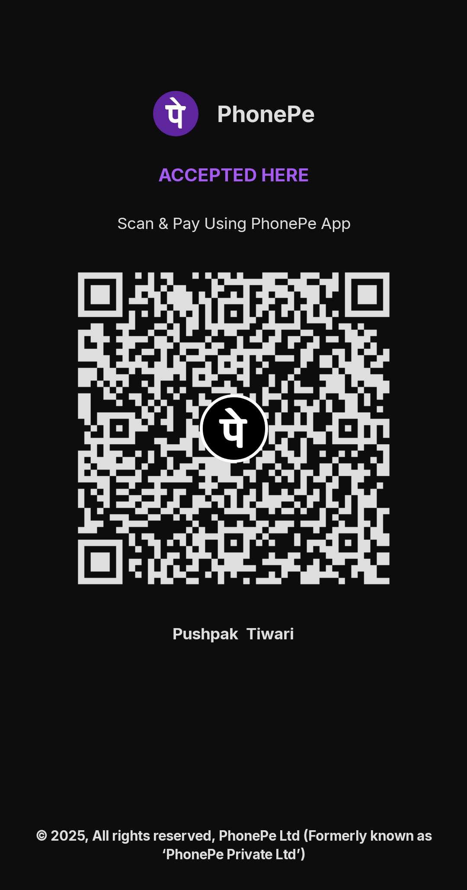

# ENIGMA XIII - Cultural Festival Website

A modern, responsive website for ENIGMA XIII, the annual cultural festival of United Group of Institutions, Prayagraj.

## 🎉 About

ENIGMA XIII is the official cultural festival website showcasing events, gallery, sponsors, and registration for the festival scheduled on **November 21-22, 2025**.

## ✨ Features

- **Modern UI/UX Design** - Beautiful animations and effects
- **Responsive Design** - Works seamlessly across all devices (mobile, tablet, desktop)
- **Event Management** - Browse events by category with detailed event pages
- **Gallery** - View photos and videos from ENIGMA XII (previous year)
- **Sponsors Section** - Showcase festival sponsors with marquee animation
- **Registration** - Integrated registration form
- **Smooth Animations** - Parallax effects, fade-in animations, hover effects
- **Video Background** - Hero section with video background

## 🛠️ Technologies Used

- **HTML5** - Semantic markup
- **CSS3** - Modern styling with CSS Variables, Flexbox, Grid
- **JavaScript** - Interactive features, animations, filtering
- **Fonts** - Google Fonts (Montserrat, Lato)

## 📁 Project Structure

```
ENIGMA/
├── index.html              # Homepage
├── about.html              # About page
├── events.html             # Events listing page
├── event-detail.html       # Individual event detail page
├── gallery.html            # Gallery page
├── sponsors.html           # Sponsors page
├── registration.html       # Registration page
├── global.css              # Global styles and CSS variables
├── header.css              # Header component styles
├── footer.css              # Footer component styles
├── home.css                # Homepage specific styles
├── events.css              # Events page styles
├── event-detail.css        # Event detail page styles
├── gallery.css             # Gallery page styles
├── registration.css        # Registration page styles
├── animations.css          # Animation styles
├── header.js               # Header functionality
├── events.js               # Events filtering
├── event-detail.js         # Event detail page logic
├── gallery.js              # Gallery image/video loading
├── animations.js           # Scroll animations, parallax
├── main.js                 # Custom cursor, video handling
└── assests/
    ├── logo/               # ENIGMA logo
    ├── enigma xii/         # Gallery images and videos
    ├── sponseer/           # Sponsor logos
    └── video/              # Hero section video
```

## 🚀 Getting Started

1. **Clone or Download** the repository
2. **Open** `index.html` in a web browser
3. **No build process required** - Pure HTML, CSS, and JavaScript

## 📱 Responsive Breakpoints

- **Mobile**: < 480px
- **Tablet**: 481px - 768px
- **Desktop**: 769px - 992px
- **Large Desktop**: > 992px

## 🎨 Color Scheme

- **Primary**: Cyan (#00FFFF)
- **Secondary**: Magenta (#FF00FF)
- **Background**: Dark (#0A0A0A)
- **Surface**: Dark Gray (#111111)
- **Text Primary**: White (#FFFFFF)
- **Text Secondary**: Light Gray (#AAAAAA)

## 📝 Event Information

- **Festival Dates**: November 21-22, 2025
- **Registration Fee**: ₹300 for two event participation
- **Mode**: All events are offline (except gaming events)

## 📧 Contact

- **Email**: enigma@united.edu.in
- **Instagram**: [@enigmafest_25](https://www.instagram.com/enigmafest_25/)
- **Address**: 8WV8+Q4H, Nevada Samogar, dairy, United Naini, Naini, Prayagraj, Uttar Pradesh 211010

## 👨‍💻 Development Team

**Made by** [Pushpak Tiwari](https://github.com/pushpaktiwarii), [Prashant Pandey](https://github.com/prashantucer), [Prashant Maurya](https://github.com/prashantmauryaa) with team

## ☕ Buy me a Coffee!

### 💳 Payment QR Code



**How to use:**
1. Open your UPI app (PhonePe, Google Pay, Paytm, etc.)
2. Scan the QR code above
3. Enter the amount and confirm payment

## 📄 License

Copyright by ENIGMA XIII. All rights reserved.

## 🙏 Acknowledgments

- United Group of Institutions for hosting ENIGMA XIII
- All sponsors and participants

---

**Made with ❤️ for ENIGMA XIII**

